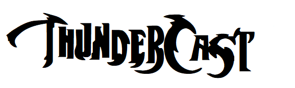
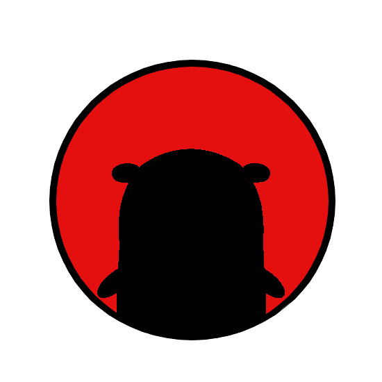

# ThunderCast

ThunderCast is a golang wrapper for UDPCast.

## Data Diode Tool 

### Install

#### Requirments 

- Two Servers 
- Physical Data Diode (Can be built easily)
- Golang 

### Steps 
1. Pull repo into both servers 
2. Sending run `go run send.go`
3. Recieving   run `go run listen.go`
4. Localhost on port `3000` for sending 
5. Localhost on port `3001` for recieving 

## API 

### gosender

Reicieve File @ `curl -F "file=@[filename.type]" localhost:3000/upload/`

### goreciever 

Listen File @ `localhost:3001/listen/v1?filename=[filename]&hash=[hash]`

List Files @ `localhost:3001/files/`

Delete Files @ `localhost:3001/delete/v1?id=[file_id]`
- file_id is the index of the file from the list of files returned from List Files call. 

